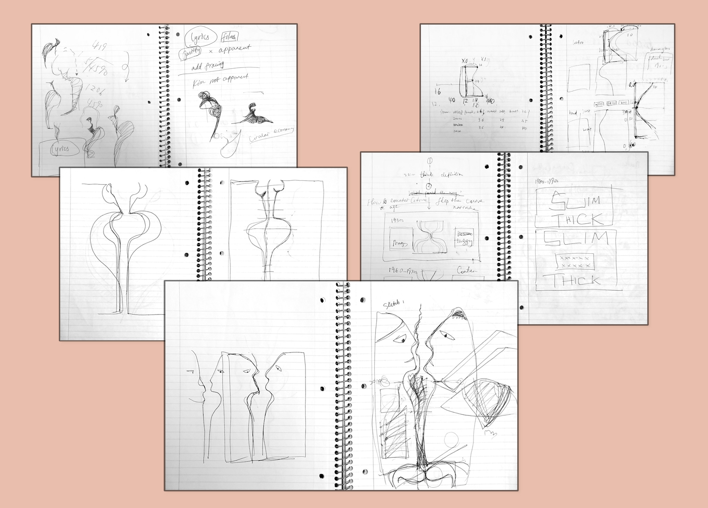
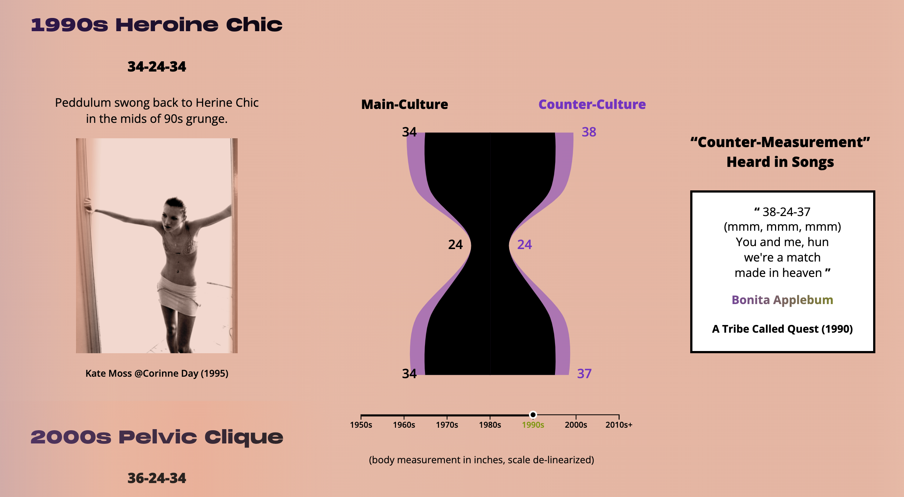
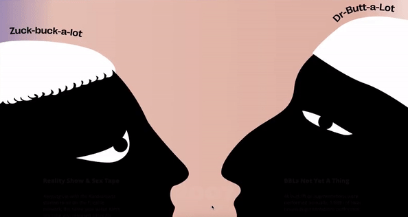
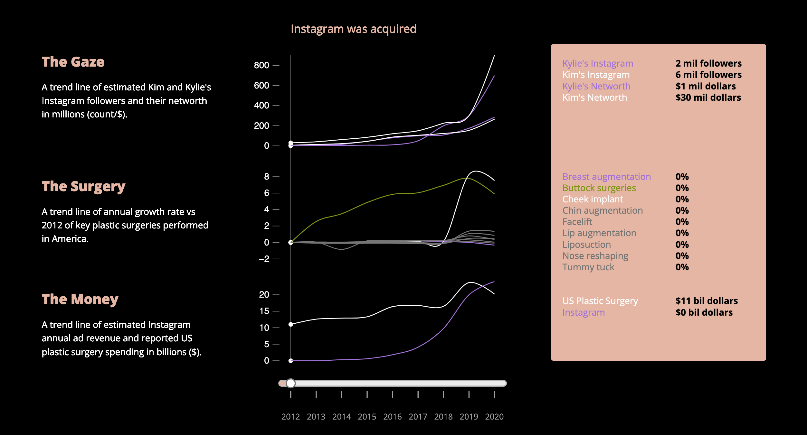

# Introduction
This is my final project at the Data Vis & Info Aesthetics class during my first year study of Data Visualization at Parsons School of Design.

Slim Thick is an uncommon female body type that consists of a flat stomach, toned thighs, and large booties that originated from a voluptuous body form celebrated as a counterculture over seven decades ago, and was eventually adopted and popularized by the Kardashians in conjunction with the rise and dominance of social media.

I decided to dig deeper into this topic when I started to hear more and more stories about teenage girls’ obsession with Slim Thick. The idealization of the Slim Thick body is a phenomenon I attributed to the continuation of the historical male gaze and capitalist exploitation of the female body. It is also another example of appropriation of the Black culture, all against the backdrop of the growing normality of plastic surgery and algorithmic reinforcement of social media.

### Design Concept
The main design element is an optical illusion of the male gaze, which is composed of two silhouettes featuring Zuck-Buck-A-Lot (social media) and Dr. Butt-A-Lot (plastic surgery). The negative space between the silhouettes resembles the outline of the Slim Thick body. 

Body contouring will be a recurring theme and is also used in one of the charts. Background color is set to be a peculiar type of skin tone that represents the "manufactured look of rootless exoticism", with accent colors resembling the Kardashian family's cosmetic lines.

Initial Prototype 

 
 I began with the idea of body contouring that gradually transitioned to an optical illusion.

 
 The dual area chart revisits the body contour theme.

##
### Data
The dataset is hand gathered and compiled across multiple sources including [US Plastic Surgery Statistics](https://www.plasticsurgery.org/news/plastic-surgery-statistics), Statista, eMarketer and Bloomberg.

You can download the processed [dataset](https://github.com/muonius/msdv-slim-thick-united-curves-of-america/tree/master/data) here.

### Narrative
I strive to achieve a balance between a pop culture representation and rigorous research and analysis. 

### Development
All charts including reference lines and sliders are done in `d3.js`. For UI, I used the following libraries.
- [sticky scroll](https://pudding.cool/process/scrollytelling-sticky/)
- [scrollama](https://github.com/russellgoldenberg/scrollama)
- [d3-simple-slider](https://www.npmjs.com/package/d3-simple-slider)

I continue to explore how to improve UI & UX on multi-layered data. I was presented with a challenge that I had lots of info that I wanted to compare side by side that a hover-over, moving tooltip would be overwhelming. I eventually chose to use a slider with reference lines.

## Credit
This is my first web based data visualization project and I owe every little bit of progress made to the amazing community of friends, classmates and practitioners. Thank you for brainstorming with me, showing me what’s possible out there, encouraging me to experiment, and critiquing from tiny details to structural thinking. I am fortunate to be part of this community.

## Bibliography
- Mbowe, Khadija. “The reign of the Slim-Thick Influencer.” Aug 22, 2021. [https://www.youtube.com/watch?v=H69-QpX-wG0](https://www.youtube.com/watch?v=H69-QpX-wG0).
- Morris, Desmond. *The Naked Women*. [St. Martin's Publishing Group](https://www.google.com/search?hl=en&gbpv=1&dq=rap+songs+that+praise+the+booty&pg=PA228&printsec=frontcover&q=inpublisher:%22St.+Martin%27s+Publishing+Group%22&tbm=bks&sa=X&ved=2ahUKEwjL6Y6m6uL0AhUTmGoFHYdABf4QmxMoAHoECCAQAg&sxsrf=AOaemvK1LA1sBEAMVwVmRXAwWZRMr6r2Hg:1639469090915), 2007.
- Beauvoir, Simone. *The Second Sex*. New York: Vintage Books, 1989. Print.
- Richardson, Kiesha. “Stop Trying to Redefine ‘Thicc girls’ to Mean Skinny With a Booty.” GNL Magazine. Sep 29, 2021. [https://genelmag.com/article/stop-trying-to-redefine-thicc](https://genelmag.com/article/stop-trying-to-redefine-thicc).
- Tolentino, Jia. “The Age of Instagram Face.” The New Yorker. Dec 12, 2019. [https://www.newyorker.com/culture/decade-in-review/the-age-of-instagram-face](https://www.newyorker.com/culture/decade-in-review/the-age-of-instagram-face).
- Chauntell, Monet. “Slim-Thick, the New Skinny.” Sep 17, 2017. [https://www.unstrippedvoice.com/3660-slim-thick-the-new-skinny/](https://www.unstrippedvoice.com/3660-slim-thick-the-new-skinny/).
- Pure Gym. “Understanding Ideal Body Shapes Through History.” Jan 29, 2021. [https://www.puregym.com/blog/body-shapes](https://www.puregym.com/blog/body-shapes).
- Greatiest.com. “See How Much the ‘Perfect’ Female Body Has Changed in 100 Years (It's Crazy!).” [https://greatist.com/grow/100-years-womens-body-image#1](https://greatist.com/grow/100-years-womens-body-image#1)
- Sicardi, Arabelle. “The Kardashian Effect.” Allure. Feb 16, 2021. [https://www.allure.com/story/the-kardashian-effect](https://www.allure.com/story/the-kardashian-effect).
- Roundtree, Cheyenne. *“How the Kardashians Changed the Face of Plastic Surgery.”* The Daily Beast. June 12, 2021. [https://www.thedailybeast.com/how-the-kardashians-changed-the-face-of-plastic-surgery](https://www.thedailybeast.com/how-the-kardashians-changed-the-face-of-plastic-surgery).
- Kim, Eunice. “The Marketing of Black Women’s Body in Hip-Hop.” UCSD Guardian. Mar 7, 2021. [https://ucsdguardian.org/2021/03/07/the-marketing-of-black-womens-body-in-hip-hop/](https://ucsdguardian.org/2021/03/07/the-marketing-of-black-womens-body-in-hip-hop/).
- Squires, Wendy. “Sorry, folks, but this is not the fresh new face of feminism.” The Sydney Morning Herald. Aug 28, 2020. [https://www.smh.com.au/culture/music/sorry-folks-but-this-is-not-the-fresh-new-face-of-feminism-20200827-p55q0h.html](https://www.smh.com.au/culture/music/sorry-folks-but-this-is-not-the-fresh-new-face-of-feminism-20200827-p55q0h.html).
- Kuppinger, Skyllar. “Teenagers and Plastic Surgery.” UCLA Medical Literature Society. [http://www.ucla-mls.com/teenagers-and-plastic-surgery.html](http://www.ucla-mls.com/teenagers-and-plastic-surgery.html).